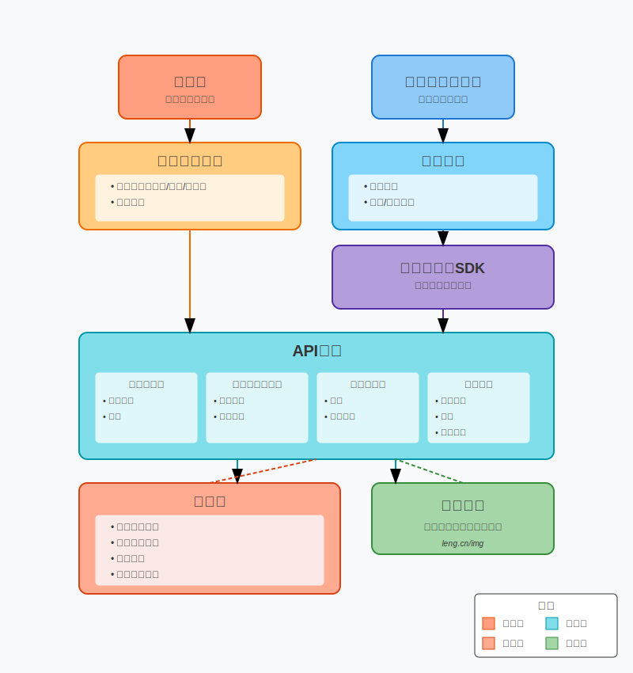

    

<h1 align="center">API 接口开放平台</h1>

<strong>API 接口开放平台是一个为用户和开发者提供全面API接口调用服务的平台 🛠</strong>

## 项目介绍 🙋

**😀 作为用户您可以通过注册登录账户，获取接口调用权限，并根据自己的需求浏览和选择适合的接口。您可以在线进行接口调试，快速验证接口的功能和效果。**

**💻 作为开发者 我们提供了[客户端SDK: API-SDK](https://github.com/xiaoleng-ros/lengapi-backend)， 通过开发者凭证即可将轻松集成接口到您的项目中，实现更高效的开发和调用。**

**🤝 您可以将自己的接口接入到API 接口开放平台平台上，并发布给其他用户使用。 您可以管理和各个接口，以便更好地分析和优化接口性能。**

**👌 我们还提供了[开发者在线文档]()和技术支持，帮助您快速接入和发布接口。**

**🏁 无论您是用户还是开发者，API 接口开放平台都致力于提供稳定、安全、高效的接口调用服务，帮助您实现更快速、便捷的开发和调用体验。**

## 网站导航 🧭

- [**API 后端 🏘️**](https://github.com/xiaoleng-ros/lengapi-backend)

- [**API 前端 🏘**️](https://github.com/xiaoleng-ros/lengapi-frontend)

-  **[API 接口开放平台 🔗](http://api.iceuu.icu)**

-  **[API-DOC 开发者文档 📖]()**

## 目录结构 📑

| 目录                                                                                        | 描述        |
|-------------------------------------------------------------------------------------------|-----------|
| **🏘️ [api-backend](https://github.com/xiaoleng-ros/lengapi-backend)**                    | API后端服务模块 |
| **🏘️ [api-common](https://github.com/xiaoleng-ros/lengapi-backend/lengapi-common)**      | 公共服务模块    |
| **🕸️ [api-gateway](https://github.com/xiaoleng-ros/lengapi-backend/lengapi-gateway)**    | 网关模块      |
| **🔗 [api-interface](https://github.com/xiaoleng-ros/lengapi-backend/lengapi-interface)** | 接口模块      |
| **🛠 [api-sdk](https://github.com/xiaoleng-ros/lengapi-backend/lengapi-client-sdk)**      | 开发者调用sdk  |
| **📘 [api-doc]()**                                                                        | 接口在线文档    |

## 项目流程 🗺️

## 快速启动 🚀

### 后端

管理员初始账号密码：admin/123456789

## 项目选型 🎯

### **后端**

- Spring Boot 2.7.2
- Spring MVC
- MySQL 数据库
- 腾讯云COS存储
- Dubbo 分布式（RPC、Nacos）
- Spring Cloud Gateway 微服务网关
- API 签名认证（Http 调用）
- Swagger + Knife4j 接口文档
- Spring Boot Starter（SDK 开发）
- JWT（JSON Web Token）分布式登录
- Apache Commons Lang3 工具类
- MyBatis-Plus 及 MyBatis X 自动生成
- Hutool、Apache Common Utils、Gson 等工具库

### 前端

- React 18
- Ant Design Pro 5.x 脚手架
- Ant Design & Procomponents 组件库
- Umi 4 前端框架
- OpenAPI 前端代码生成

## 功能介绍 📋

| **功能**                                                           | 游客 | **普通用户** | **管理员** |
|------------------------------------------------------------------|----|----------|---------|
| **[开发者API在线文档]()**                                               | ❌  | ❌        | ❌       |
| 接口大厅搜索接口、浏览接口                                                    | ✅  | ✅        | ✅       |
| 邮箱验证码登录注册                                                        | ❌  | ❌        | ❌       |
| [**API-SDK**](https://github.com/xiaoleng-ros/lengapi-backend)使用 | ❌  | ✅        | ✅       |
| 在线调试接口                                                           | ❌  | ✅        | ✅       |
| 更新头像                                                             | ❌  | ✅        | ✅       |
| 绑定、换绑、解绑邮箱                                                       | ❌  | ❌        | ❌       |
| 用户管理、封号解封等                                                       | ❌  | ❌        | ✅       |
| 接口管理、接口发布审核、下架                                                   | ❌  | ❌        | ✅       |

